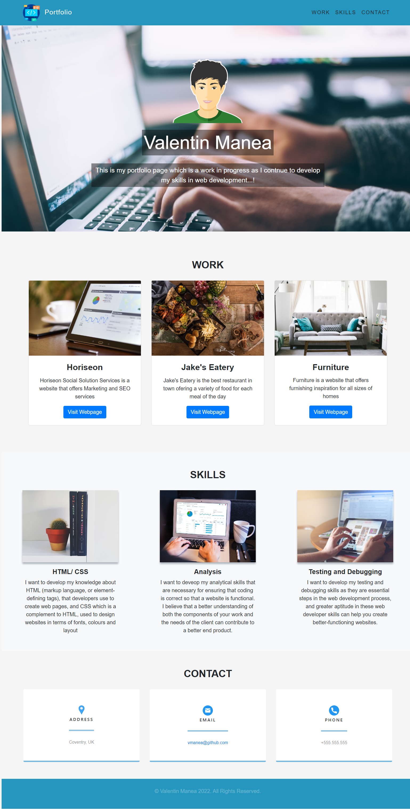

# Valentin Manea Portfolio - Bootstrap-Portfolio

## Description

The task for this assignment was to create a new portfolio web page, this time using the bootstrap framework, according to the requirements and share the links to the work already done during the class inside it.

## Screenshot

## Links

<ul>
  <li>Deployed application: https://valimanea.github.io/Bootstrap-Portfolio/</li>
  <li>GitHub Repository: https://github.com/valimanea/Bootstrap-Portfolio</li>
</ul>
